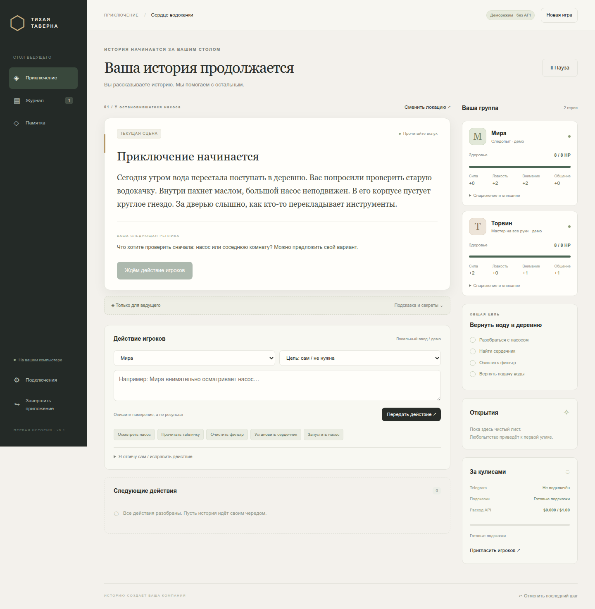

# Тихая таверна · DnD Helper

Помощник для первой настольной ролевой игры. Ведущий читает подсказки с ноутбука, игроки отправляют действия Telegram-боту. Программа хранит факты и считает броски; GPT помогает разбирать свободный текст и формулировать ответы.

**Работает без ключей:** в демонстрационном режиме доступно приключение «Сердце водокачки» на 30–40 минут для 1–2 игроков. Вы управляете персонажами и бросками с экрана ведущего.

Проект также служит основой для обучения и портфолио: передаются полный исходный код, тесты и инструкции сборки.



## Быстрый запуск на Linux

В этой рабочей папке окружение уже подготовлено:

```bash
./start.sh --data-dir ./data
```

Так тестовые игры и настройки остаются в игнорируемой Git папке `data/` проекта. Без `--data-dir` используется стандартный пользовательский каталог, описанный ниже.

На другом компьютере с установленным `uv`:

```bash
uv sync --frozen
uv run --frozen python -m dnd_helper
```

Откроется локальная страница, обычно `http://127.0.0.1:8765`. При занятом порте выбирается свободный. Нажмите **«Собрать группу»**, оставьте деморежим и начните приключение.

Для запуска без открытия браузера и с отдельной тестовой базой:

```bash
uv run --frozen python -m dnd_helper --no-browser --data-dir /tmp/dnd-test --port 8766
```

## Запуск из исходников на Windows

Нужны Python 3.12 и `uv`. Из PowerShell в папке проекта:

```powershell
py -3.12 -m pip install uv==0.11.32
py -3.12 -m uv sync --frozen
py -3.12 -m uv run --frozen python -m dnd_helper
```

После подготовки окружения можно запускать `start.cmd`. Node.js и Docker не используются. Команды для Windows подготовлены; проверка на реальном Windows-ноутбуке ещё предстоит.

**Для готового Windows-пакета установка Python не нужна.** Пакет собирается на Windows через [workflow](.github/workflows/check.yml), который выполняет тесты, упаковывает приложение и сохраняет ZIP вместе с исходниками в артефактах Actions. После проверки архив можно прикрепить к GitHub Release. Windows-пакет собран и проверен на Windows runner: [успешный запуск CI](https://github.com/Maxveger/DnD_helper/actions/runs/34968229530). Проверка на ноутбуке ведущего с Windows 10/11 остаётся следующим этапом. Linux-пакет собирается тем же скриптом.

## Свои сценарии из чата GPT

**«Мои сценарии» → скопировать промпт → обсудить историю в чате → «Собери документ» → вставить JSON → проверить → добавить в библиотеку → играть.** При ошибках приложение выдаёт готовое задание для исправления в том же чате.

Лор, герои, характеристики, кубик, действия, условия, переходы и финалы задаются документом. Поддерживаемые механики перечислены в промпте; неподдерживаемые правила нельзя молча загрузить как работающие. Для первого знакомства есть пример «Последний сигнал» с d6. [Инструкция и формат](docs/ADVENTURE_FORMAT.md) · [Полный промпт для чата](docs/AUTHOR_KIT.md).

## Что реализовано

- Экран ведущего: текущая реплика, следующая подсказка, карточки, секреты, очередь, журнал, пауза и отмена.
- Создание группы, две сцены и полный мирный путь до финала.
- Проверки, помощь, перевязи, короткий бой, отступление и продолжение после поражения.
- SQLite: сохранение каждого изменения, восстановление после перезапуска, контрольные точки и резервные копии.
- Защита от повторного применения команд и бросков, устаревших ответов и неверных ролей.
- Telegram-адаптер: приглашения, карточки, текст, голосовые, исправления текста, программные и физические броски.
- GPT-адаптер: Responses API со структурированным ответом, отдельное распознавание и учёт бюджета.
- Локальные настройки ключей, встроенный конвертер аудио и подготовка упакованного приложения.

## Подключение GPT и Telegram

Откройте **«Подключения»**, вставьте отдельно полученные ключи и включите нужные сервисы. До этого приложение не вызывает их. Пример формата настроек: [settings.example.json](settings.example.json).

Чтобы присоединить реальных игроков, создайте игру без отметки «Демо», дождитесь подключения бота и откройте «Пригласить игроков». Игроки и ведущий получают разные ссылки. Ссылку ведущего не передавайте игрокам.

Живые запросы к GPT и Telegram пока **не проверены с настоящими ключами**. Форматы запросов, ошибки, роли, дублирование и конвертация аудио проверяются автоматическими тестами с подставными HTTP-ответами.

## Ограничения первой версии

- Библиотека приключений, встроенные правила водокачки и исполнитель `declarative@1`; одна активная сессия на установку. Произвольная редакция D&D требует отдельного модуля, а не только текста её правил.
- Основные исходы подготовлены заранее. GPT распознаёт действия по закрытому каталогу; неожиданные случаи остаются ведущему. Приключение можно подготовить в отдельном чате и импортировать; приложение не создаёт новые правила во время игры.
- Свободный текст без GPT использует небольшой словарь во встроенной истории и точные названия действий в импортированной. Для надёжного демо есть кнопки действий.
- «Другой вариант» меняет текст, сохраняя механику; смысловая корректность свободной формулировки не гарантирована только проверкой схемы.
- Экспорт сохранения есть, автоматического импорта пока нет. При необходимости базу можно перенести с резервной копией и совместимой версией приложения.
- Кратковременные ошибки API сохраняют консервативный резерв бюджета. Отображаемая сумма может отличаться от фактического счёта.
- Совместимость Windows 10/11 и работа живого Telegram/GPT проверяются отдельно перед передачей ведущему.

## Проверки

```bash
uv run --frozen pytest -q
uv run --frozen ruff check dnd_helper tests scripts
uv run --frozen python scripts/smoke.py
```

Браузерный прогон на отдельно запущенной **тестовой** установке; скрипт создаёт новую игру:

```bash
uv run --frozen playwright install chromium
uv run --frozen python scripts/browser_check.py --url http://127.0.0.1:8766 --output /tmp/dnd-screenshots
# Импортируемое приключение, автоматически создаёт изолированную установку:
uv run --frozen python scripts/browser_import_check.py
```

## Сборка и передача исходников

Сборка выполняется на той ОС, для которой нужен пакет:

```bash
uv run --frozen python scripts/build.py
uv run --frozen python scripts/source_archive.py
```

Результат находится в `dist/`. Исходники собираются по явному списку файлов; локальные настройки, окружение, журналы и игровые базы в архив не включаются.

## Документация

- [GitHub: исходники, совместная работа и скачивание Windows-сборки](docs/GIT_WORKFLOW.md)

- [Импорт приключений и требования к документу](docs/ADVENTURE_FORMAT.md)
- [Краткая инструкция ведущему](docs/PLAYER_SETUP.md)
- [Устройство приложения](docs/ARCHITECTURE.md)
- [Проведённые проверки и оставшиеся этапы](docs/VERIFICATION.md)
- [Участие в разработке](CONTRIBUTING.md)
- [Техническое задание](docs/MVP_SPEC.md)
- [Упрощённые правила](docs/RULES.md)
- [Приключение: содержит секреты ведущего](docs/ADVENTURE.md)
- [План передачи и критерии Windows-поставки](docs/DISTRIBUTION.md)
- [Исходная идея](DnD.pdf)

Данные по умолчанию: `%LOCALAPPDATA%\DnDHelper` на Windows, `$XDG_DATA_HOME/dnd-helper` (обычно `~/.local/share/dnd-helper`) на Linux. Для изоляции тестов используйте `--data-dir`. Ключи находятся в `settings.local.json` внутри каталога данных и не входят в экспорт игры.
