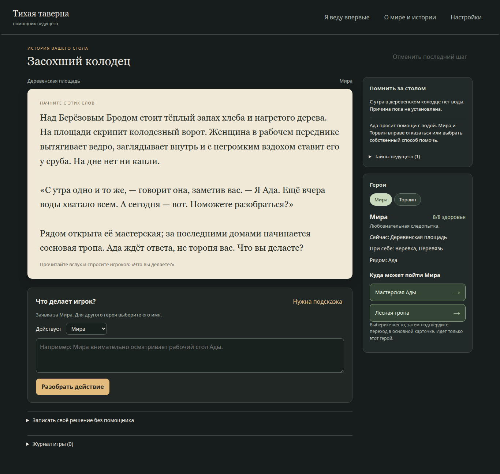

# Тихая таверна · DnD Helper

Локальный подсказчик для **начинающего ведущего настольной ролевой игры**. Игроки обсуждают действия за столом; ведущий вводит заявку, получает реплику и предложенные последствия, проверяет и подтверждает их. Приложение хранит позиции героев, здоровье, вещи и факты мира.

**[Путеводитель по документации](docs/README.md)** · [Первый запуск](docs/PLAYER_SETUP.md) · [Продолжение разработки](docs/NEXT_STEPS.md)

## Что работает сейчас

Текущая версия из исходников: текстовый экран `/world`, собственный вход ведущего через Codex CLI, модель Luna. Одна карточка требует одного запроса, включая обе ветки броска. Подтверждение, кубик, правки, известные переходы и заметки работают локально.

- Крупная реплика для чтения игрокам; последствия и служебные сведения раскрываются отдельно.
- Память стола, переключаемые карточки героев, помощь новичку и отдельное описание мира и фабулы.
- Свои сценарии `dnd-world@1`: комплект для браузерного GPT, проверка документа и рекомендации по исправлению.
- Сохранение в SQLite, отмена, экспорт и загрузка журнала `dnd-world-log@1`.
- Стартовый пример «Засохший колодец» 1.1.0 с Мирой и Торвином.



Модель предлагает черновик; ведущий отвечает за прочитанный текст и принятые последствия. Полная партия 30–40 минут ещё не проверена. Одна карточка относится к одному действующему герою; Telegram, голос и альтернативный API к этому режиму ещё не подключены. [Возможности и ограничения](docs/GM_ASSISTANT.md).

## Запуск на Linux

В подготовленной рабочей папке:

```bash
./start.sh --data-dir ./data
```

В новом checkout с установленным `uv`:

```bash
uv sync --frozen
uv run --frozen python -m dnd_helper --data-dir ./data
```

Откройте **«Помощник ведущего»** или `/world` по адресу запущенного приложения — обычно `http://127.0.0.1:8765/world`. При занятом порте фактический адрес будет другим.

Для генерации нужен отдельно установленный Codex CLI: адаптер проверяет версию не ниже 0.154.0 и вход через ChatGPT. В **«Настройках»** доступны вход и проверка подключения. API-ключ для этого режима не используется; приложение не переключается на платный API при ошибке. Проверена работа с CLI 0.154.0 на Linux. [Устройство подключения](docs/CODEX_PROVIDER.md).

В текущем интерфейсе начать знакомство помогают **«Я веду впервые»** и **«О мире и истории»**. Подробный порядок — в [инструкции ведущему](docs/PLAYER_SETUP.md).

## Windows: исходники и готовый пакет

Для разработки из исходников нужны Python 3.12 и `uv`. В PowerShell:

```powershell
py -3.12 -m pip install uv==0.11.32
py -3.12 -m uv sync --frozen
py -3.12 -m uv run --frozen python -m dnd_helper
```

После подготовки окружения можно использовать `start.cmd`. Веб-интерфейс не требует Node.js для сборки; зависимости установки Codex отдельные.

Известный опубликованный кандидат [v0.1.0-rc.1](https://github.com/Maxveger/DnD_helper/releases/tag/v0.1.0-rc.1) содержит **прежние подготовленные приключения**. Текущего помощника и последнего интерфейса в нём нет. Его ZIP полностью распаковывают и запускают `DnD-Helper.exe`, сохраняя `_internal` рядом; Python не нужен.

Обновлённую версию предстоит собрать и проверить на Windows и ноутбуке ведущего. Готовый пакет приложения не отменяет отдельной установки и входа Codex. [План поставки](docs/DISTRIBUTION.md).

## Два игровых режима

| | Помощник ведущего `/world` | Подготовленные приключения `/` |
| --- | --- | --- |
| История | Свободные заявки в пределах канона | Заранее описанные действия и исходы |
| Документ | `dnd-world@1` | `dnd-adventure@1` |
| Продолжение из файла | `dnd-world-log@1` с проверкой событий | Экспорт для просмотра; продолжение из локальной базы |
| Модель | Codex, сейчас Luna | Демо без модели; отдельный GPT API-адаптер |
| Telegram и голос | Не подключены | Адаптеры реализованы; реальные ключи не проверены |

Без подключения модели можно пройти старое демо «Сердце водокачки»: **«Собрать группу» → «Демо» → «Начать приключение»**. Это подготовленная история, её тексты не показывают качество Luna. [Документы прежнего режима](docs/README.md#prepared).

## Разработка и проверки

```bash
uv run --frozen pytest -q
uv run --frozen ruff check dnd_helper tests scripts
uv run --frozen python scripts/smoke.py
```

Изолированный браузерный прогон текущего помощника, с тестовыми ответами и без расхода подписки:

```bash
uv run --frozen playwright install chromium
PYTHONPATH=. uv run --frozen python scripts/browser_world_check.py
```

Последняя проверка функциональной версии: **156 тестов**, браузерный прогон на Linux; три пробы настоящей Luna после обновления стиля — **8,5–11 секунд**. Это короткие измерения, не гарантия времени каждой карточки. [Сводка и команды](docs/VERIFICATION.md).

Сборка выполняется на целевой ОС:

```bash
uv run --frozen python scripts/build.py
uv run --frozen python scripts/source_archive.py
```

Архивы находятся в `dist/`. [Участие в разработке](CONTRIBUTING.md) · [Git](docs/GIT_WORKFLOW.md) · [Архитектура](docs/ARCHITECTURE.md).

## Данные

По умолчанию: `%LOCALAPPDATA%\DnDHelper` на Windows, `$XDG_DATA_HOME/dnd-helper` (обычно `~/.local/share/dnd-helper`) на Linux. `--data-dir` задаёт другой каталог; для тестов используйте отдельный.

Две базы: `free-world.sqlite3` для помощника и `game.sqlite3` для подготовленного режима. API/Telegram-ключи прежнего режима находятся в `settings.local.json`; авторизацию Codex хранит сам CLI. Ключи и игровые данные исключены из Git. Экспорт мира содержит тайны ведущего — он предназначен для продолжения игры, а не раздачи игрокам.
