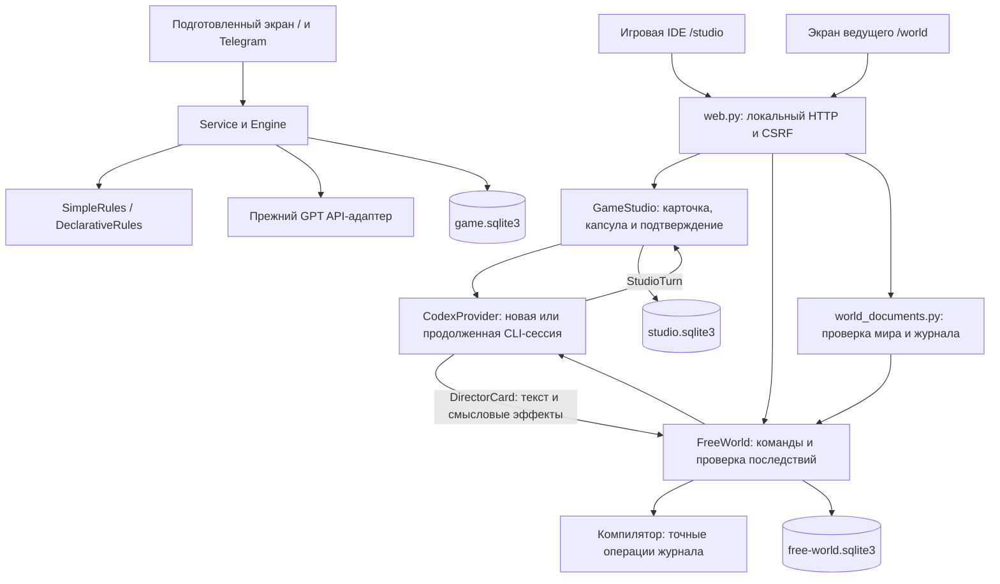

# Устройство приложения

[← Путеводитель](README.md) · [Подсказчик ведущего: один запрос на карточку](GM_ASSISTANT.md) · [Что проверено](VERIFICATION.md)

Срез исходников на 2026-09-21. Активный эксперимент описан в [игровой IDE](GAME_STUDIO.md); `/world` ниже сохранён как прежний помощник. Продуктовые границы задаёт [основа проекта](PROJECT_BRIEF.md).

## Три режима в одном локальном приложении

| | Игровая IDE | Прежний помощник | Подготовленные приключения |
| --- | --- | --- | --- |
| Экран | `/studio`, `static/studio.*` | `/world`, `static/world.*` | `/`, `static/app.*` |
| Управление | `GameStudio` | `FreeWorld` | `Service` + `Engine` |
| Хранение | `studio.sqlite3` | `free-world.sqlite3` | `game.sqlite3` |
| Контент | Встроенный лабораторный срез | `dnd-world@1`, `intent-simple` | Встроенное приключение или `dnd-adventure@1` |
| Модель | Одна сессия `CodexProvider` | Независимые вызовы `CodexProvider` | `OpenAIProvider`, Telegram |

Обе базы используют механизмы `Store` из `storage.py`, но состояния и игровые команды режимов различаются. Импорт одного формата не переключает его автоматически на другой исполнитель.

## Карта кода

| Файл | Ответственность |
| --- | --- |
| [launcher.py](../dnd_helper/launcher.py) | Один экземпляр, выбор локального порта, браузер и завершение |
| [web.py](../dnd_helper/web.py) | HTTP-маршруты трёх режимов, локальный доступ и CSRF |
| [studio.py](../dnd_helper/studio.py) | Живая модельная беседа, три канала, карточка, капсула, подтверждение и локальный бросок |
| [free_world.py](../dnd_helper/free_world.py) | `DirectorCard`, компиляция смысловых эффектов, точные операции мира, проверки, подтверждение и отмена |
| [world_documents.py](../dnd_helper/world_documents.py) | Модели мира/журнала, семантическая проверка, воспроизведение событий, комплект автора |
| [codex_provider.py](../dnd_helper/codex_provider.py) | CLI, вход, схема ответа, тайм-аут/отмена, безопасные ошибки и usage |
| [storage.py](../dnd_helper/storage.py) | SQLite, транзакции, квитанции команд, контрольные точки; также outbox и бюджет прежнего режима |
| [service.py](../dnd_helper/service.py), [engine.py](../dnd_helper/engine.py) | Жизненный цикл сервисов; очередь и фазы подготовленных приключений |
| [rules.py](../dnd_helper/rules.py), [declarative.py](../dnd_helper/declarative.py) | Исполнители встроенных и импортированных подготовленных правил |
| [adventures.py](../dnd_helper/adventures.py), [content.py](../dnd_helper/content.py) | Контракт/библиотека подготовленных приключений и встроенная водокачка |
| [providers.py](../dnd_helper/providers.py), [telegram.py](../dnd_helper/telegram.py) | Прежние API и Telegram/голосовые адаптеры |
| [config.py](../dnd_helper/config.py) | Настройки API/бота и признаки подключения без раскрытия ключей |
| [static/](../dnd_helper/static/), [resources/](../dnd_helper/resources/) | Веб-интерфейсы без frontend-сборки, авторские материалы и примеры |

## Одна карточка текущего помощника

1. Браузер передаёт ведущего героя, выбранных участников, `command_id` и ожидаемую `revision`. Совет и обязательное режиссёрское указание являются разными командами.
2. `FreeWorld` сохраняет заявку и собирает ограниченную папку одного хода: физически представленные сущности, известные удалённые сущности, возможные введения, факты, нужные скрытые ограничения, рамку сцены, доступные/закрытые маршруты, два последних результата и заранее рассчитанные механические варианты. Полный документ и весь журнал не передаются.
3. `CodexProvider` запускает независимый `codex exec --ephemeral` и возвращает `DirectorCard`: намерение, живую реплику, проверку и крупные смысловые эффекты. При риске обе ветки готовятся сразу.
4. Компилятор превращает `present`, `reveal`, `transition`, `travel` и другие смысловые эффекты в точные операции. Он сам подставляет маршрут, прежнее состояние, допустимый метод и ступень давления.
   Если наблюдение осталось пустым, рамка сцены может локально добавить следующий авторский `cue` и `present`; неокончательная неудача может сделать то же для ветки провала. Это не второй модельный запрос.
5. Код применяет каждую ветку на копии, добавляет обязательные реакции и финал, затем проверяет живых участников, доступность, предусловия переходов, знания, HP, смерть и необратимость. Одинаковые механические ветки броска отклоняются. Ошибка карточки не запускает скрытый второй запрос; ведущий видит отказ и решает, уточнять ли заявку.
6. Кубик и выбор ветки выполняются локально. Ведущий видит рассчитанные последствия, редактирует текст либо требует пересобрать карточку по своему указанию.
7. Подтверждение одной транзакцией сохраняет контрольную точку, новый мир и событие. Повтор команды не повторяет эффект, устаревший ответ не применяется к новой заявке.

Кнопка места локально строит весь известный безопасный маршрут. Помощь к броску, заметка ведущего, правки, отмена и импорт также не вызывают модель.

## Память, журнал и восстановление

SQLite хранит активное состояние, события, незавершённую карточку, режиссёрское указание и диагностику вызовов. Принятые факты хранятся как каноническое состояние; модельный транскрипт и ID сессии не используются. Отмена использует контрольные точки, а учёт вызовов не откатывается.

`dnd-world-log@1` переносит исходный документ и события. Импорт восстанавливает состояние проверенным повторением операций; это отдельный контракт, а не копия SQLite. В экспорт не входят ключи и неподтверждённая карточка. [Подробности формата](WORLD_FORMAT.md).

`new`/импорт заменяют активную игру; прежнее состояние сохраняется служебно, но выбора нескольких сохранений в интерфейсе нет. Для возвращения к партиям используйте экспортированные журналы. Тестовые прогоны всегда используют отдельные каталоги.

## Где проходит граница доверия

Модель не пишет в базу и не формирует низкоуровневые `before/after` вручную. Код проверяет типы, ID, владение и расход предметов, маршруты, объявленные состояния, открытия знаний, броски, HP и порядок применения. После пробной ветки он детерминированно исполняет `reactions` и `endings` из закреплённого документа. Исходные факты автора не удаляются моделью. Подтверждение остаётся ведущему.

Свободный текст может ошибаться и противоречить операциям; JSON Schema этого не доказывает. Поэтому `read_aloud` — редактируемый черновик на секретном экране ведущего. Он не отправляется игрокам. Публичный канал потребует отдельной проверки разглашения.

CLI запускается из нейтрального временного каталога с отключёнными инструментами и пользовательской конфигурацией; обнаруженное инструментальное событие отвергается. Только `/studio` сохраняет транскрипт короткой модельной сессии средствами Codex, чтобы `resume` мог продолжить разговор. `/world` остаётся эфемерным. Это меры адаптера, не доказательство полной изоляции произвольной версии CLI. [Контракт провайдера](CODEX_PROVIDER.md).

## Что осталось от прежнего режима

`Engine` обрабатывает очередь участников и каталог действий. `SimpleRules` обслуживает «Сердце водокачки», `DeclarativeRules` — импортированные документы. Их API-адаптер классифицирует действие по каталогу и отдельно переформулирует готовый исход; Telegram использует привязки ролей и outbox. Этот путь не является текущим пайплайном `/world`.

Новая редакция правил требует программного исполнителя. Текстом можно описать ручные исключения, но нельзя незаметно включить новую автоматическую механику. [Подготовленный формат](ADVENTURE_FORMAT.md).

## Проверки

[Сводка проверок](VERIFICATION.md) содержит команды и границы подтверждённого. Тесты текущего режима находятся в [test_free_world.py](../tests/test_free_world.py) и [test_world_documents.py](../tests/test_world_documents.py); браузерный сценарий — [browser_world_check.py](../scripts/browser_world_check.py). У текущего помощника один путь разрешения намерения; старого рассказчика и отдельного конвейера совместимости нет.
