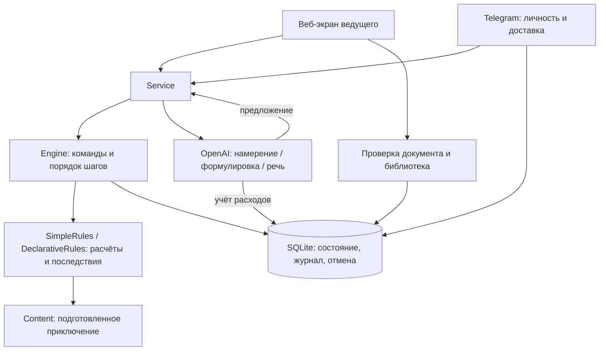

# Устройство приложения

Этот документ описывает текущую реализацию. Следующий этап с постоянной памятью мира и свободной импровизацией описан в [FREE_WORLD_SPEC.md](FREE_WORLD_SPEC.md), исходные принципы — в [HYBRID_WORLD.md](HYBRID_WORLD.md). После исправления замечаний к списку действий пользователь 2026-09-16 поручил перейти к новому этапу; актуальные задачи — в [NEXT_STEPS.md](NEXT_STEPS.md).

Для следующего этапа выбран [Codex CLI как основной LLM-провайдер](CODEX_PROVIDER.md), Responses API — альтернативный. Ниже описан существующий API-адаптер; Codex и общий контракт провайдеров ещё предстоит реализовать.

## Модули

- `launcher.py`: один экземпляр приложения, локальный порт, открытие браузера, завершение.
- `web.py`: HTTP, локальный доступ, CSRF, статические файлы и маршруты команд.
- `service.py`: связывает ядро с необязательными внешними сервисами, выполняет GPT-запросы вне транзакций.
- `engine.py`: сессия, участники, очередь, фазы шага, подтверждение, отмена и публичное представление игрока.
- `rules.py`: проверки, эффекты предметов, бой и ограничения подготовленного приключения. Здесь нет сети или SQL.
- `content.py`: встроенная водокачка.
- `adventures.py`: строгие модели документа, семантическая проверка ссылок, библиотека и комплект автора с генерируемой схемой.
- `declarative.py`: ограниченный исполнитель действий и эффектов импортированных приключений; не загружает код из документа.
- `resources/`: промпт для браузерного чата и пример космического приключения.
- `storage.py`: SQLite-транзакции, квитанции команд, контрольные точки для отмены, исходящие сообщения и бюджет.
- `providers.py`: классификация намерений, переформулировка исхода, преобразование и распознавание голоса.
- `telegram.py`: polling, привязка Telegram ID, меню, запросы бросков, исправления и доставка сообщений.
- `config.py`: отдельные локальные настройки, закрытые значения ключей и публичные признаки подключения.
- `static/`: HTML, CSS и JavaScript без отдельного frontend toolchain.

## Один шаг: осмотр насоса

1. Веб или бот передаёт текст и ID персонажа. Для Telegram автор берётся из привязанного user ID.
2. Готовая кнопка задаёт ID действия напрямую. Свободный текст без GPT проходит маленький демонстрационный словарь. С GPT неизвестное действие классифицируется по закрытому каталогу; несколько разных действий остаются для уточнения ведущим.
3. `submit` помещает свободный ввод или сообщение Telegram в очередь; первое действие готовится при свободном текущем шаге. Быстрая кнопка использует `choose`: готовит допустимое действие сразу либо заменяет текущее уточнение, сохраняя остальные заявки. Во время проверки, броска или подтверждения другая быстрая кнопка недоступна. Для осмотра `SimpleRules.prepare()` создаёт предложение проверки Внимания со сложностью 10.
4. Ведущий запрашивает бросок. Запрос получает уникальный ID и сохраняется вместе с заданием отправить кнопку игроку.
5. Игрок бросает либо вводит число. Повторная доставка не создаёт второй результат. Программа считает итог.
6. До «Продолжить» результат виден как предложение, мир ещё не изменился.
7. При принятии сохраняется контрольная точка, открывается улика, добавляется запись журнала и задания обновить карточки. Это одна транзакция.
8. Следующее действие готовится уже на обновлённом состоянии.

В общем списке вариантов интерфейс показывает доступные действия выбранного героя и цели и переходы `scene` с названием места назначения. Завершённые шаги водокачки определяются по текущим фактам и попыткам; импортированные одноразовые действия — по `once` и принятым попыткам. Это работает после загрузки старого сохранения и отмены шага. Необратимого локального списка «уже нажимали» в браузере нет. Повторяемые действия сохраняются, когда правила их допускают. При текущей проверке, ожидании броска или готовом исходе новые варианты скрыты; переходы также скрыты во время боя и уточнения.

## Почему сохранение устроено так

В MVP в базе одна активная сессия. Состояние хранится JSON-документом внутри SQLite: для короткого учебного прототипа это делает проверку и отмену понятными. Транзакция охватывает связанные записи, а номер состояния монотонно растёт даже при новой игре.

Это не полноценная архитектура восстановления исключительно из событий: журнал служит историей, а восстановление использует сохранённое состояние и контрольные точки. Роли и бюджет при отмене не откатываются. Перед заменой сессии создаётся резервная копия базы.

Входящие команды имеют уникальные квитанции. Исходящие сообщения сохраняются в outbox и отправляются повторно после сбоя. Telegram не обеспечивает общую транзакцию с нашей базой, поэтому уведомление иногда может прийти повторно; повтор кнопки или входящего действия не должен повторить игровой эффект.

## Граница доверия GPT

GPT не получает инструмента записи в базу. Для разбора действия модель возвращает только `intent` и `target`; схема и ядро проверяют их. Сложности, HP, урон и последствия задаёт модуль правил.

Основной игровой путь использует подготовленные тексты. Кнопка «Другой вариант» отдельно вызывает переформулировку готового исхода. В запросе на переформулировку нет всего приключения и скрытых планов: только допустимый исход. Это снижает риск, но не доказывает смысловую корректность свободного текста — ведущий видит пометку о GPT-формулировке.

Распознавание аудио работает с временным файлом, конвертер включается в пакет. Приложение удаляет свои временные записи после обработки. Это не удаляет исходное сообщение из Telegram.

При неизвестной цене модели платный запрос запрещается. До вызова сохраняется резерв, после ответа — usage. При неизвестном итоге запроса сохраняется консервативный резерв, чтобы ошибка сети не обнулила возможный расход. Для распознавания по минутам применяется оценка; отображаемая сумма не гарантирует точного совпадения со счётом провайдера.

## Расширение правил

`SimpleRules` обслуживает прежнюю встроенную водокачку. `DeclarativeRules` исполняет импортированный `dnd-adventure@1`. Оба поддерживают `prepare`, `roll`, `apply`, `manual`, `validate` и `initial_world`. Каталог и представление сцены берутся из сохранения выбранной игры: интерфейс и Telegram получают её характеристики, кубик и названия.

В `Engine` выбор исполнителя происходит для конкретного состояния внутри команды, без переключения общего глобального объекта правил. Новая версия документа сохраняется под хешем содержимого в SQLite. Игра хранит собственную копию определения; фоновые GPT-запросы возвращают ID текущего предложения и не могут перезаписать уже изменившийся шаг.

Проверка импорта не изменяет состояние, установка добавляет запись библиотеки, создание новой партии выполняется отдельной командой с контролем версии и резервным копированием. Форма импорта проверяет документ повторно на сервере, неизвестные поля/операции/версии запрещены. Весь процесс доступен без API. [Полный контракт](ADVENTURE_FORMAT.md).

Произвольные новые системы правил всё ещё требуют программного модуля. Редакция с отличающейся математикой не подключается по названию или свободному описанию. Согласованные ручные исключения явно перечисляются в документе и показываются ведущему.

## Проверка

`tests/test_engine.py` проверяет механические инварианты, последовательность, отмену, победу, поражение и продолжение после провала. `tests/test_integrations.py` проверяет доступ, роли, структуру запросов, ошибки API, расходы и реальные операции конвертера с подставным ответом распознавания.

`scripts/smoke.py` проверяет настоящий HTTP-сервер и может запускать упакованный исполняемый файл. `scripts/browser_check.py` проходит приключение через браузер на отдельно запущенном демосервере. Живые GPT/Telegram-запросы в автоматических тестах не выполняются.

`tests/test_adventures.py` проверяет импорт, версии, ошибки ссылок/операций, d6, отдельные персонажи, приватность, обе ветки проверки, финалы и сохранения. `scripts/browser_import_check.py` запускает изолированный источник или упакованный exe и проверяет импортированную историю через UI.
