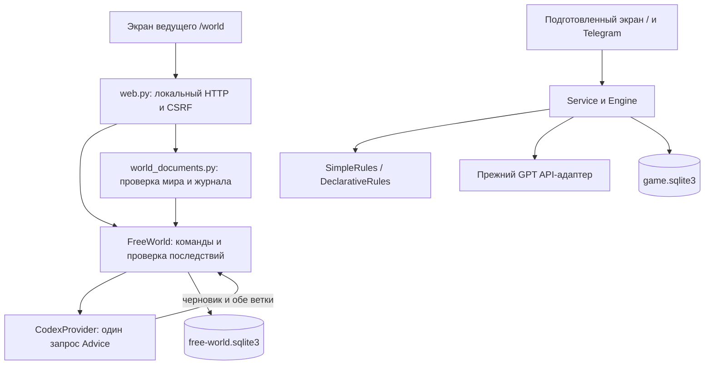

# Устройство приложения

[← Путеводитель](README.md) · [Подсказчик ведущего: один запрос на карточку](GM_ASSISTANT.md) · [Что проверено](VERIFICATION.md)

Срез исходников на 2026-09-16. Продуктовые границы задаёт [основа проекта](PROJECT_BRIEF.md), пользовательский процесс — [руководство ведущего](GM_ASSISTANT.md).

## Два режима в одном локальном приложении

| | Текущий помощник | Подготовленные приключения |
| --- | --- | --- |
| Экран | `/world`, `static/world.*` | `/`, `static/app.*` |
| Управление | `FreeWorld` | `Service` + `Engine` |
| Хранение | `free-world.sqlite3` | `game.sqlite3` |
| Контент | `dnd-world@1`, `hybrid-simple@1` | Встроенное приключение или `dnd-adventure@1` |
| Внешние сервисы | `CodexProvider` | `OpenAIProvider`, Telegram |

Обе базы используют механизмы `Store` из `storage.py`, но состояния и игровые команды режимов различаются. Импорт одного формата не переключает его автоматически на другой исполнитель.

## Карта кода

| Файл | Ответственность |
| --- | --- |
| [launcher.py](../dnd_helper/launcher.py) | Один экземпляр, выбор локального порта, браузер и завершение |
| [web.py](../dnd_helper/web.py) | HTTP-маршруты обоих режимов, локальный доступ и CSRF |
| [free_world.py](../dnd_helper/free_world.py) | `Advice`, операции мира, проверки, команды, фоновый вызов, подтверждение и отмена |
| [world_documents.py](../dnd_helper/world_documents.py) | Модели мира/журнала, семантическая проверка, воспроизведение событий, комплект автора |
| [codex_provider.py](../dnd_helper/codex_provider.py) | CLI, вход, схема ответа, тайм-аут/отмена, безопасные ошибки и usage |
| [storage.py](../dnd_helper/storage.py) | SQLite, транзакции, квитанции команд, контрольные точки; также outbox и бюджет прежнего режима |
| [service.py](../dnd_helper/service.py), [engine.py](../dnd_helper/engine.py) | Жизненный цикл сервисов; очередь и фазы подготовленных приключений |
| [rules.py](../dnd_helper/rules.py), [declarative.py](../dnd_helper/declarative.py) | Исполнители встроенных и импортированных подготовленных правил |
| [adventures.py](../dnd_helper/adventures.py), [content.py](../dnd_helper/content.py) | Контракт/библиотека подготовленных приключений и встроенная водокачка |
| [providers.py](../dnd_helper/providers.py), [telegram.py](../dnd_helper/telegram.py) | Прежние API и Telegram/голосовые адаптеры |
| [config.py](../dnd_helper/config.py) | Настройки API/бота и признаки подключения без раскрытия ключей |
| [static/](../dnd_helper/static/), [resources/](../dnd_helper/resources/) | Веб-интерфейсы без frontend-сборки, авторские материалы и примеры |

## Одна карточка текущего помощника

1. Браузер передаёт команду, выбранного героя, `command_id` и ожидаемую `revision`. Совет отличается от игрового действия режимом `hint`.
2. `FreeWorld` сохраняет ожидающую заявку и собирает контекст: документ мира, сущности, факты и последние шесть принятых событий без советов.
3. `CodexProvider` возвращает структурированный `Advice`: подсказку, основания, черновик речи, операции, а при риске — проверку и обе ветки результата. Обычная карточка использует **один вызов**.
4. Код проверяет ссылки и допустимость операций, рассчитывает обе ветки. Неправильное предложение не применяется. При вопросе требуется уточнение, при совете нет механических операций.
5. Кубик и выбор ветки выполняются локально. Ведущий видит рассчитанные последствия, может исправить текст или убрать эффекты.
6. Подтверждение одной транзакцией сохраняет контрольную точку, новый мир и событие. Повтор команды не повторяет эффект, устаревший ответ не применяется к новой заявке.

Известный переход по кнопке, заметка ведущего, правки, отмена и импорт не вызывают модель. Совместные действия группы ещё не имеют отдельного механического контракта.

## Память, журнал и восстановление

SQLite хранит активное состояние, события, незавершённую карточку и диагностику вызовов. Принятые факты хранятся отдельно от короткого окна последних событий; модель не переписывает сводку как единственный источник истины. Отмена использует контрольные точки, учёт вызовов не откатывается.

`dnd-world-log@1` переносит исходный документ и события. Импорт восстанавливает состояние проверенным повторением операций; это отдельный контракт, а не копия SQLite. В экспорт не входят ключи и неподтверждённая карточка. [Подробности формата](WORLD_FORMAT.md).

`new`/импорт заменяют активную игру; прежнее состояние сохраняется служебно, но выбора нескольких сохранений в интерфейсе нет. Для возвращения к партиям используйте экспортированные журналы. Тестовые прогоны всегда используют отдельные каталоги.

## Где проходит граница доверия

Модель не пишет в базу. Код проверяет типы, ID, владение и расход предметов, связи мест, броски, HP и порядок применения. Исходные факты автора не удаляются моделью. Подтверждение остаётся ведущему.

Свободный текст может ошибаться и противоречить операциям; JSON Schema этого не доказывает. Поэтому `read_aloud` — редактируемый черновик на секретном экране ведущего. Он не отправляется игрокам. Публичный канал потребует отдельной проверки разглашения.

CLI запускается в отдельном временном каталоге с отключёнными инструментами и пользовательской конфигурацией; обнаруженное инструментальное событие отвергается. Это меры адаптера, не доказательство полной изоляции произвольной версии CLI. [Контракт провайдера](CODEX_PROVIDER.md).

## Что осталось от прежнего режима

`Engine` обрабатывает очередь участников и каталог действий. `SimpleRules` обслуживает «Сердце водокачки», `DeclarativeRules` — импортированные документы. Их API-адаптер классифицирует действие по каталогу и отдельно переформулирует готовый исход; Telegram использует привязки ролей и outbox. Этот путь не является текущим пайплайном `/world`.

Новая редакция правил требует программного исполнителя. Текстом можно описать ручные исключения, но нельзя незаметно включить новую автоматическую механику. [Подготовленный формат](ADVENTURE_FORMAT.md).

## Проверки

[Сводка проверок](VERIFICATION.md) содержит команды и границы подтверждённого. Тесты текущего режима находятся в [test_free_world.py](../tests/test_free_world.py) и [test_world_documents.py](../tests/test_world_documents.py); браузерный сценарий — [browser_world_check.py](../scripts/browser_world_check.py). Старую цепочку оставили только в частях совместимости со старыми сохранениями, а не как обязательный путь новой карточки.
