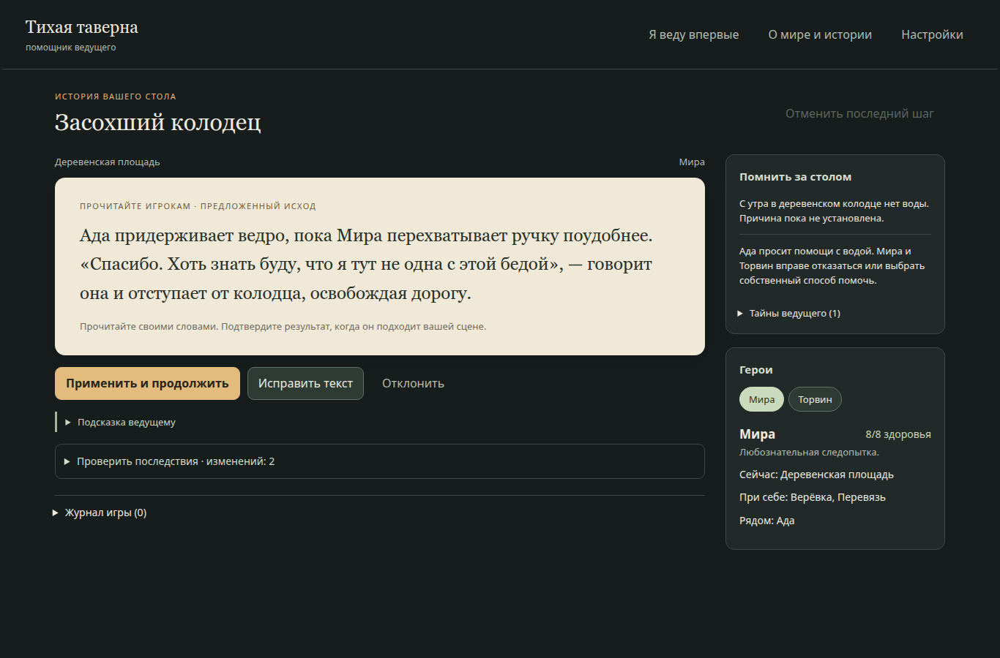

# Экран для начинающего ведущего

Итерация 2026-09-16 после пользовательского прогона.

## Что мешало

Постоянно видимые подключение и импорт, перемешанные реплика/расчёты/основания, длинная колонка героев, неочевидные кнопки перехода. Совет выглядел как игровой исход, а режим сохранялся для следующего ввода. Текст мира давал ведущему факты без атмосферы и связной фабулы.

## Изменения

- На игровом столе — крупная реплика, одна основная кнопка, текущий герой и компактная память. При готовой карточке скрыт ввод следующего действия.
- Подключение, модель, сценарии/журнал, перезапуск и диагностика находятся в отдельном окне «Настройки».
- «Подсказка ведущему» и «Проверить последствия» раскрываются по нажатию. Расчёт состояния сохранён; доверие к тексту не превращается в автоматическое изменение мира.
- Одна карточка героя с кнопками имён. Переключение синхронизирует автора следующего действия; активная заявка остаётся закреплена за своим героем. Память выше героев, тайны свёрнуты.
- Направления движения имеют названия мест и стрелки; пояснение указывает, кто пойдёт и что требуется подтверждение. Они доступны, когда нет незавершённой карточки.
- У совета кнопка «Понятно · закрыть совет»; режим сбрасывается к действию сразу после отправки. Инструкция модели требует не описывать действие в режиме совета как выполненное, а также уточнять другого героя/групповую заявку.
- «Я веду впервые» объясняет пять шагов игры. «О мире и истории» даёт литературный лор и отдельную фабулу с секретом для ведущего.
- В примере 1.1.0 появились атмосфера деревни, значимость воды, мотивы и речь Ады, направления исследования и готовое вступление. Кнопка старта открывает именно этот пример с двумя героями. В старых сохранениях документ не подменяется.
- Комплект автора просит связные lore/gm_notes/intro, сохраняя текущую схему документа. Новые ответы Luna содержат обычно 3–5 предложений, поле ограничено 800 символами. Дополнительных вызовов нет.

## Вид экрана




Снимки получены браузерным тестом на отдельной вымышленной партии; вторая реплика — тестовый ответ для проверки вёрстки.

## Проверки

156 тестов прошли. Браузер проверяет скрытые настройки после старта, размер основного текста, окно лора, два и четыре переключаемых героя, синхронизацию выбора, возврат от совета к действию, последствия, редактирование, кубик, отмену, импорт/экспорт и экран 390 px. Политика CSP не ослаблялась; ожидания браузерного теста переведены на проверки значений полей.

Три отдельные проверки настоящей Luna (временные игры, один запрос на случай):

| Ситуация | Время | Результат |
| --- | ---: | --- |
| Спокойный осмотр мастерской | 10,72 с | Три предложения об обстановке вместо сухого итога; без броска и выдуманных улик |
| Разговор новичков с Адой | 10,92 с | Живая реплика и предложение следующего шага; тайна сохранена |
| «Торвин приходит…» в режиме совета за Миру | 8,53 с | Уточнение выбранного героя, нет операций и описания выполненного перехода |

Это короткие пробы, не оценка всей партии. Литературное качество остаётся неровным: во втором ответе встречается неудачное «разложенный рабочий стол»; текст можно отредактировать. Инструкция об участниках не заменяет будущую поддержку групповых действий.

В работе с инструкцией использовалась [официальная документация о формулировке промптов](https://developers.openai.com/api/docs/guides/prompt-engineering): явно заданы стиль, границы и небольшой пример. Фактические характеристики выше получены собственными измерениями.

Повторить три коротких живых случая (расходует лимит подписки):

```bash
PYTHONPATH=. uv run --frozen python scripts/gm_assistant_probe.py --codex /path/to/codex --suite prose --output /tmp/gm-prose.json
```
